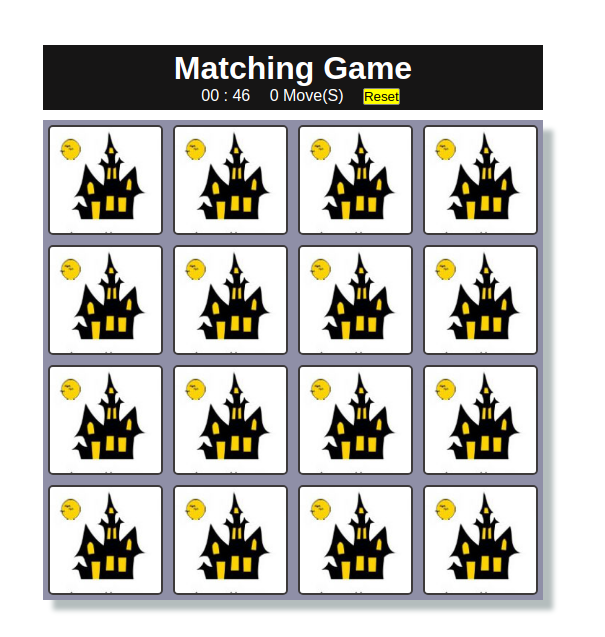

 

# Matching game

## What it does
In this game the player has to match similar pictures. 

# Rules and how to play it

- When you open the app, the count down starts from 1min:30s
- The player has 1 min 30s and 20 clicks to find all the matching images
- Break one of the conditions above, the page will automatically reload
- If the player finds the images and their matching the congratulation message is displayed

## Screenshot

## Built With
- HTML
- CSS
- JavaScript
#### and deployed to Github

## Live Demo

[Live Demo](https://theophile-kango.github.io/matching-game/)

## Getting Started

To get a local copy up and running follow these simple example steps.
- Clone the project unto your local machine
- `cd` into the project directory
- Open up index.html in your browser to view the project

## Author

👤  **Theophile Kango**

- Github: [@githubhandle](https://github.com/Theophile-Kango)
- Twitter: [@twitterhandle](https://twitter.com/Theophadh)
- Linkedin: [linkedin](https://www.linkedin.com/in/theophile-kango)

## 🤝 Contributing

Feel free to check the [issues page](https://github.com/Theophile-Kango/mapping-game/issues).

## Show your support

Give a ⭐️ if you like this project!

## 📝 License

This project is licensed by Chingu.

### Enjoy!
